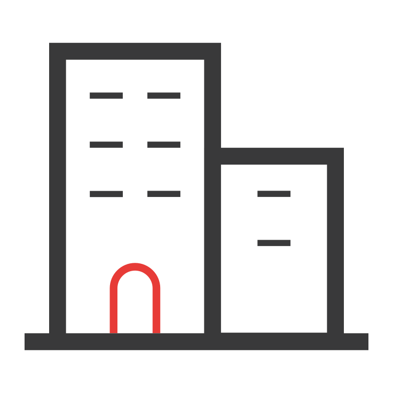

<h1 align="center">👋 Hi everyone, Welcome to my github profile</h1>

<h1 align="center">I am Nguyen Chi Nghia but you can call me Toof (Tồ)</h1>
<h3 align="center">A Junior web developer from VietNam </h3>

---

 <h3>About me</h3>

-  I have nearly 2 years of experience as a web developer, working in both frontend and backend roles.
-  I have worked at 3 different companies, gaining hands-on experience in real-world projects.
-  Besides coding, I also have some experience with UX/UI design using Visily and Figma.
-  Reach me anytime: ncn180501@gmail.com

---

###  <h3>Tech Stack</h3>

- Languages

 
	  JavaScript
	 TypeScript
	 Python

- 🌐 Frontend:  
  `HTML` `CSS` `SCSS` `React.js` `Next.js` `Tailwind CSS` `Antd Design` `Material UI`
- 🔧 Backend:  
  `Node.js` `Express.js` `NestJS` `Django` 
- 🗄️ Database:  
  `PostgreSQL` `MongoDB` `MySQL`
- 🔌 DevOps & Tools:  
  `Docker` `Git` `GitHub` `Postman`

---

### 📈 GitHub Stats

  
  

---

### 🔗 Connect with me

